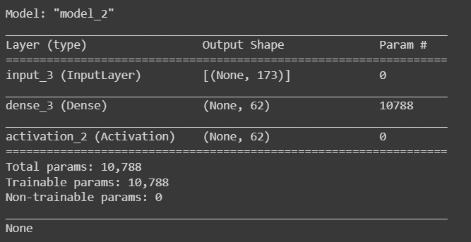
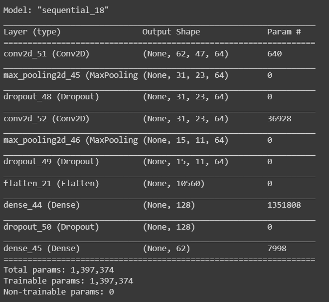
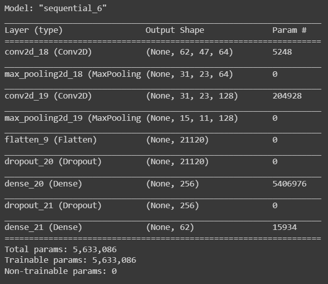
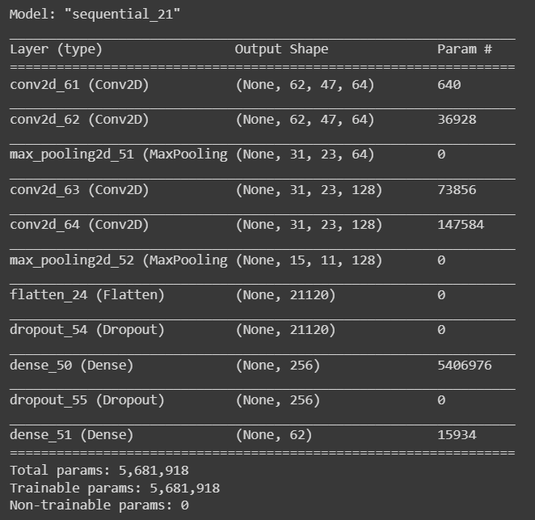
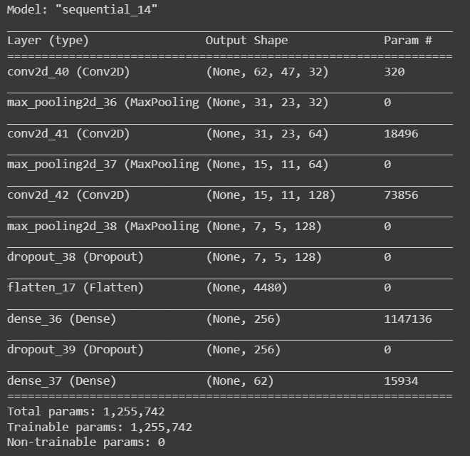
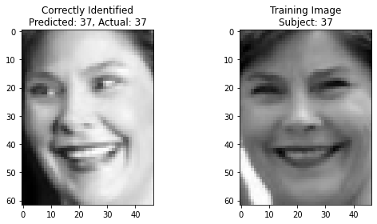
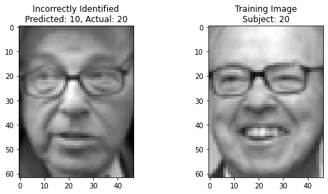

# Face-Identification-using-CNNs
This repository comprises a face identification(multi-class classification) using a subset of the Labeled Faces in the Wild (LFW) dataset.

## Overview
This repository explores different approaches to face identification using a subset of the [Labeled Faces in the Wild (LFW) dataset]. The primary focus is on comparing the performance of traditional Eigenfaces with modern Convolutional Neural Network (CNN) models.

## Objectives

- Evaluate the effectiveness of Eigenfaces, a Principal Component Analysis (PCA)-based method, for face identification.
- Compare Eigenfaces with state-of-the-art CNN models in terms of accuracy and robustness.
- Investigate the impact of varying CNN architectures, hyperparameters, and optimization techniques on face identification.
  
## Eigenfaces Overview

Eigenfaces is a Principal Component Analysis (PCA)--based dimensionality reduction technique used for face identification. It extracts features from facial images and reduces the dimensionality of the dataset.
## Logistic Regression and Eigenfaces

Eigenfaces and Logistic Regression is a traditional method for face identification. It involves flattening images and applying Principal Component Analysis (PCA) to reduce dimensionality, followed by logistic regression for classification.

- Architecture

 


## CNN Models

### CNN Model 1
- Architecture:
  
  
- Hyperparameters:
  - Optimizer: adam
  - Loss: Sparse categorical cross-entropy
  - Batch Size: 64
  - Epoch: 15

### CNN Model 2
- Architecture:
  
  
- Hyperparameters:
  - Optimizer: RMSProp
  - Loss: Sparse categorical cross-entropy
  - Batch Size: 128
  - Epoch: 20

### CNN Model 3
- Architecture:
  
  
- Hyperparameters:
  - Optimizer: Adam
  - Loss: Sparse categorical cross-entropy
  - Batch Size: 64
  - Epoch: 10

### CNN Model 4
- Architecture:
  
  
- Hyperparameters:
  - Optimizer: adam
  - Loss: Sparse categorical cross-entropy
  - Batch Size: 64
  - Epoch: 20

## Getting Started
```bash
# Clone the repository
git clone https://github.com/your-username/drowsiness-detection.git
cd face-mask-detection

# Install the required dependencies
pip install -r requirements.txt
```

## Results
The notebook provides visualizations of correctly and incorrectly identified images along with their corresponding training images.
### Correctly Identified Image


### Incorrectly Identified Image


## License
This project is licensed under the Apache License 2.0 - see the LICENSE file for details.

## Acknowledgments
- Dataset: Labeled Faces in the Wild (https://vis-www.cs.umass.edu/lfw/)
